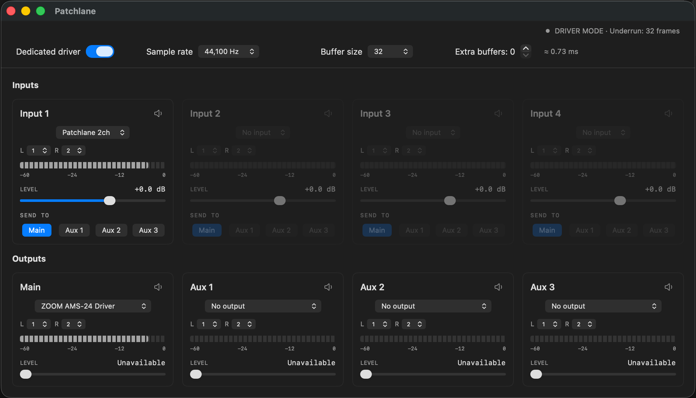

# Patchlane

Audio routing for macOS on Apple Silicon. Route audio from apps and devices to up to four stereo outputs, with input gain, channel selection, and live level meters.



## Features

- Four stereo inputs routed independently to Main, Aux 1, Aux 2, and Aux 3.
- Built-in Patchlane 2ch and Patchlane 8ch virtual audio devices.
- Dedicated driver mode for a direct shared-memory audio path to output devices.
- Adjustable sample rate, buffer size, and additional buffering.
- Output sliders control the selected device's volume. Devices without volume control show a disabled slider.
- Automatic reconnection after interruptions or sustained underruns.
- English and Japanese localization, with light and dark appearance following macOS.
- Automatic settings persistence and restoration of dedicated driver mode at launch.

## Requirements

- macOS 13 or later
- A Mac with Apple Silicon

## Installation

Download a distribution ZIP from [Releases](https://github.com/masanaohayashi/Patchlane/releases), when available, and run `Patchlane-Installer.pkg`. The installer includes the app and both virtual audio devices. Audio may stop briefly during installation.

To uninstall, run the included `Patchlane Uninstaller.app`. Saved settings and other vendors' audio drivers are preserved.

## Getting started

1. Choose an input device and its left/right channels.
2. Use **SEND TO** to select the output buses for that input.
3. Select an output device and left/right channels for each bus you want to use.
4. Adjust the input gain and output device volume as needed.

The mixer starts automatically while the app is open.

### Route audio from another app

Set the source app's output—or the macOS sound output—to **Patchlane 2ch** or **Patchlane 8ch**, then select the same device as an input in Patchlane. The two virtual devices are independent; the source and input selections must match.

Use **Patchlane 2ch** for stereo workflows, including QuickTime screen recording with a stereo audio source.

### Dedicated driver mode

Enable **Dedicated driver** to route Input 1 from a Patchlane virtual device directly to the selected outputs. Inputs 2–4 are disabled in this mode. Input gain, routing, channel selection, and meters remain available in the same interface.

Turning this mode on stops the normal mixer before connecting. Turning it off automatically resumes the normal mixer. Changing connection settings reconnects the audio path with the new settings.

### Buffering and latency

Both modes retain one base buffer. **Extra buffers: 0** means one buffer in total; **Extra buffers: 1** means two, and so on.

The displayed latency is an estimate of internal buffering:

```text
(buffer size × (extra buffers + 1)) / sample rate
```

For example, 32 samples at 44.1 kHz with no extra buffers corresponds to about 0.73 ms. This is not measured end-to-end latency: device latency and callback timing also contribute. Increase buffering if your setup produces dropouts.

Settings are saved automatically in `~/Library/Application Support/Patchlane/`.

## Build from source

Requires Xcode Command Line Tools with Swift 5.9 or later. There are no external Swift package dependencies.

```sh
git clone https://github.com/masanaohayashi/Patchlane.git
cd Patchlane
bash scripts/build-app.sh
```

The Release app is written to `build/Patchlane.app`. Local builds use ad-hoc signing by default. For dedicated driver connections, place the app at `/Applications/Patchlane.app` and install the dedicated driver components.

To build the installer and uninstaller:

```sh
bash scripts/package-driver.sh
```

This produces `build/Patchlane-Installer.pkg` and `build/Patchlane Uninstaller.app`.

## Tests

```sh
swift test -j 1
bash scripts/test-driver.sh
bash scripts/test-realtime.sh
python3 scripts/test-uninstaller.py
```

## License

[MIT](LICENSE) © 2026 Masanao Takeuchi.
